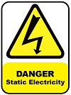

# Development Board

The chosen FPGA development board is a [Zybo Z7](https://digilent.com/reference/programmable-logic/zybo-z7/start) (Zynq-7010 variant). But as the subset of functionality is small, many other boards will be suitable too, for the sake of modifying the outer level VHDL.

Setup is as simple as:
* Plug the board in to a USB socket via the Micro USB socket just below the On/Off switch. Zybo's documentation says this is J12, but it was J11 on our board. (Scary moment..)

Place the board somewhere accessible so that the LEDs can be seen and the 4 push buttons and 4 toggle switches can be changed.

Take care to use Anti-static precautions that prevent the board being damaged by a minor static shock.
