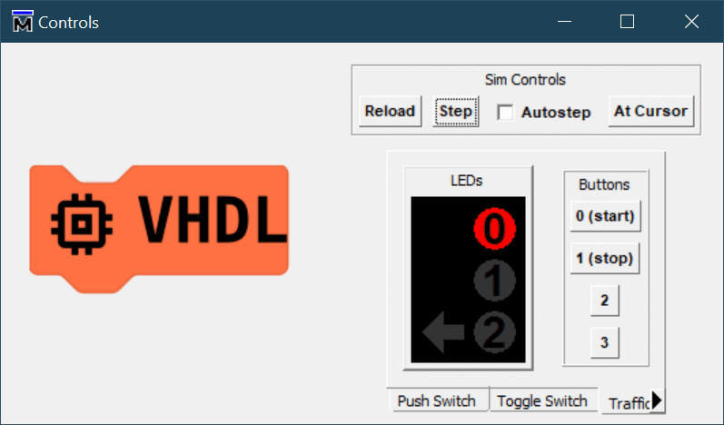

# Traffic Lights

These come in two variations, the standard junction and the Pelicon Crossing. An integer is used as the state variable again, but the state machine now uses inputs to intervene in (or control) the linear sequence. The next state to move to is now specified manually rather than by a counter.

We're now getting much closer to a classical [Finite State Machine](https://en.wikipedia.org/wiki/Finite-state_machine).

## Standard Junction

Create the correct pattern of lights for starting and stopping, each operated by a push button.

Reference: [Highway Code](https://www.gov.uk/guidance/the-highway-code/light-signals-controlling-traffic) [[PDF](https://assets.publishing.service.gov.uk/media/560aa3f9e5274a036900001c/the-highway-code-light-signals-controlling-traffic.pdf)]

## Pelicon Crossing

Similar to the above, but implement the flashing amber light sequence. Again with `start` and `stop` buttons.

Reference: [Flashing amber traffic lights](https://www.passmefast.co.uk/resources/driving-advice/traffic-light-sequence-guide) (www.passmefast.co.uk)